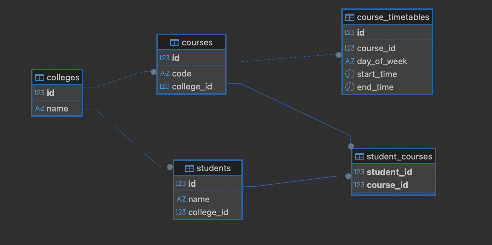

## Environment Configuration

The application uses environment variables for configuration.

A sample configuration file `.env.example` is provided at the project root.
Create a `.env` file using this example and update the values as needed.

```bash
cp .env.example .env
```

## Database Schema

The PostgreSQL schema for the application is available in `schema.sql` at the project root.
It defines all tables, relationships, constraints, and triggers required for the system.

## Database ER Diagram

The following ER diagram is generated directly from the PostgreSQL schema using DBeaver.



